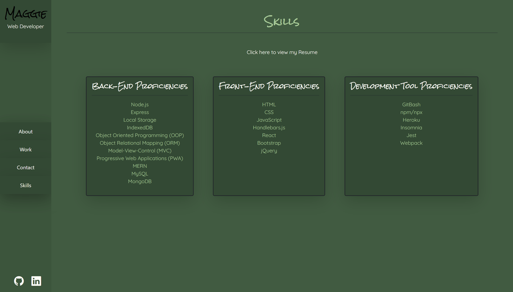

# Maggie's React Portfolio

## Table of Contents
  * [Description](#description)
  * [Screenshots](#screenshots)
  * [Deployment](#deployable-links)
  * [Technologies Used](#technologies-used)
  * [Contribution](#contribution)

## Description
Welcome to my React Portfolio! As you'll see from my deployment link below, you can view some of the work I've done up until this point through my coding course with the University of Toronto. If you'd like to see all the skills I've learned, feel free to checkout the 'Skills' section where you'll see all proficiencies and knowledge gained over the past few months. 

If you would like to get in touch with me feel free to use the the contact form or email so we can connect!

## Deployable Links
* Click [here](https://maggies-react-portfolio.herokuapp.com/) to view my deployed web application
* Click [here](https://github.com/maggiejoe/c20-my-portfolio.git) to view my gitHub repository

## Screenshots
Here's a screenshot of the 'About Me' page

Here's a screenshot of the 'Portfolio' page

Here's a screenshot of the 'Contact' page

Here's a screenshot of the 'Resume' page

## Technologies Used
* React
* HTML
* CSS
* JavaScript
* BootStrap
* Node.js

## Contribution
I'm proud to say that I built this application on my own! 